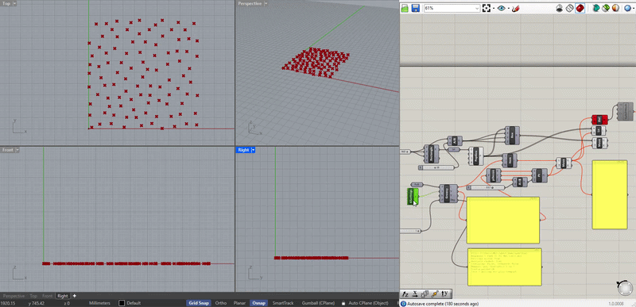

# Groovy

**Author:** Jaber Mohammed — [jaberlama123@gmail.com](mailto:jaberlama123@gmail.com)

> **Disclaimer:** This code is only for demonstration, it is not production ready nor useful, this is only for fun :)

> **AI Usage Disclaimer:** Since programming is my hobby and I just like making cool stuff, I use AI for debugging or helping me out write documentation and good code. The architecture, decisions, and structure are all mine.

---



Audio-driven kinetic motion system for Grasshopper + Rhino 8.  

## Build

### C++ Backend (GroovyCore.dll)

```bash
cd GroovyCore
cmake -B build
cmake --build build --config Release
```

Enable AVX-512 (requires Skylake-X+ or Zen 4+ CPU):
```bash
cmake -B build -DGROOVY_AVX512=ON
cmake --build build --config Release
```

Enable AVX2 auto-vectorization (requires Haswell+ CPU):
```bash
cmake -B build -DGROOVY_AVX2=ON
cmake --build build --config Release
```

### C# Plugin (Groovy_GH.gha)

```bash
cd Groovy_GH
dotnet build -f net7.0-windows -c Release
```

Output: `Groovy_GH/bin/Release/net7.0-windows/Groovy_GH.gha`

### Install

Copy everything from `bin/Release/net7.0-windows/` to `%APPDATA%\Grasshopper\Libraries\Groovy\`:

| File | Required |
|------|----------|
| `Groovy_GH.gha` | ✓ |
| `GroovyCore.dll` | ✓ |
| `NAudio*.dll` (×7) | ✓ |

## Components

### Groovy (main)

| Input | Type | Default | Description |
|-------|------|---------|-------------|
| `F` FilePath | string | — | Path to `.wav` file |
| `S` Settings | string | — | JSON config from Groovy Settings or Groovy JSON |
| `N` FFTSize | int | 2048 | FFT window, power of 2 |
| `D` Debug | bool | False | Toggle to get diagnostic info |

| Output | Type | Description |
|--------|------|-------------|
| `I` PanelIdx | List\<int\> | Panel indices for current frame |
| `V` MotionVec | List\<Vector3d\> | Motion vectors (mm, Z-axis) |
| `T` Time | double | Current playback time (seconds) |
| `Dbg` DebugOut | string | Diagnostic log (when Debug=True) |

### Groovy Settings (configurator)

| Input | Type | Description |
|-------|------|-------------|
| (none) | — | Right-click → Open Settings |

| Output | Type | Description |
|--------|------|-------------|
| `S` Settings | string | JSON config — wire to Groovy's S input |

The WPF visualizer includes:
- Waveform display with click-to-seek
- Real-time bass/mid/treble spectrum bars
- Beat pulse indicator
- Per-band range sliders, response curves, beat toggles
- Beat impulse controls (threshold, magnitude, attack/decay)
- Smoothing, FPS, panel count
- 4 presets: EDM, Techno, Classical, Rock

### Groovy JSON (editor)

| Input | Type | Description |
|-------|------|-------------|
| `I` Import | string | Optional JSON to load |

| Output | Type | Description |
|--------|------|-------------|
| `S` Settings | string | JSON config — wire to Groovy's S input |

Right-click → Open JSON Editor for a Consolas text editor with Validate, Apply, and Reset buttons.

## JSON Config Schema

```json
{
  "preset": "EDM",
  "fps": 30,
  "numPanels": 100,
  "panelGroupDistribution": {
    "bass": 0.25,
    "mid": 0.50,
    "treble": 0.25
  },
  "frequencyBands": {
    "bass": [20, 250],
    "mid": [250, 4000],
    "treble": [4000, 20000]
  },
  "panelGroups": [
    {
      "name": "Bass Punch",
      "band": "bass",
      "axis": [0, 0, 1],
      "rangeMm": [0, 600],
      "responseCurve": "exponential",
      "exponent": 2.5,
      "beatEnabled": true
    }
  ],
  "beatImpulse": {
    "enabled": true,
    "threshold": 0.4,
    "magnitudeMm": 300,
    "attackFrames": 2,
    "decayFrames": 8
  },
  "smoothing": {
    "enabled": true,
    "windowSize": 3,
    "type": "movingAverage"
  }
}
```

| Field | Type | Range | Description |
|-------|------|-------|-------------|
| `preset` | string | — | Display label only |
| `fps` | int | 1–120 | Playback frames per second |
| `numPanels` | int | 1–9999 | Total panel count |
| `panelGroupDistribution` | dict | sum ≈ 1.0 | Fraction of panels per frequency band |
| `frequencyBands` | dict | Hz pairs | Low/high frequency per band |
| `panelGroups[].band` | string | band key | Which frequency band drives this group |
| `panelGroups[].axis` | double[3] | — | Motion direction (Z-axis default) |
| `panelGroups[].rangeMm` | double[2] | 0–2000 | Min/max displacement |
| `panelGroups[].responseCurve` | string | linear / exponential / sqrt | How energy maps to displacement |
| `panelGroups[].exponent` | double | 0.1+ | Curve steepness (exponential only) |
| `panelGroups[].beatEnabled` | bool | — | Whether beat impulses fire on this group |
| `beatImpulse.threshold` | double | 0–1 | Minimum onset strength to trigger |
| `beatImpulse.magnitudeMm` | double | 0–2000 | Peak impulse displacement |
| `beatImpulse.attackFrames` | int | 1–60 | How many frames to reach peak |
| `beatImpulse.decayFrames` | int | 1–120 | How many frames to fade out |
| `smoothing.windowSize` | int | 1–60 | Moving average window |
| `smoothing.type` | string | movingAverage | Smoothing algorithm |

## Dependencies

| Layer | Library | License |
|-------|---------|---------|
| C++ | [kiss_fft](https://github.com/mborgerding/kissfft) | BSD-3 |
| C++ | [dr_wav](https://github.com/mackron/dr_libs) | MIT-0 / Public Domain |
| C# | [Grasshopper SDK](https://www.rhino3d.com/) | Rhino 8 SDK |
| C# | [NAudio](https://github.com/naudio/NAudio) | MIT |
